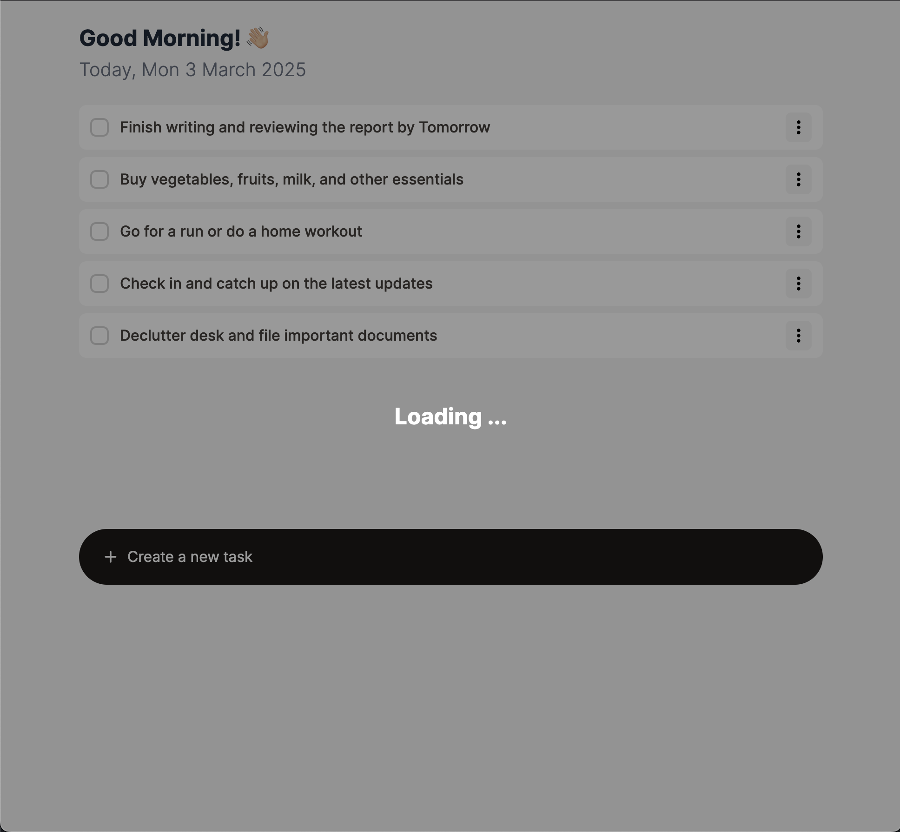

# Review tasks

## `features/todo/Element.tsx:6`

- Malformed object type
- Object also may be imported from `./types`

## `features/todo/index.tsx:46`

- Lack of keys for mapped components
- Expected ID as a key

## `features/todo/index.tsx:54`

- Modal does not close after successful submission
- Missing `onAddingSuccess` callback
- State `isPopoverOpen` line:17 should be set to false to close modal

## `features/todo/index.tsx`

- Add a global fixed loader for the app
- Loader should be in the top layer of the app so there's no possibility to click
  on anything below when it's visible
- Loader should appear on the first to do list load, and when a user deletes any list element
- You can use your CSS classes and styles or Tailwind
- Example look of the Loader:

  
